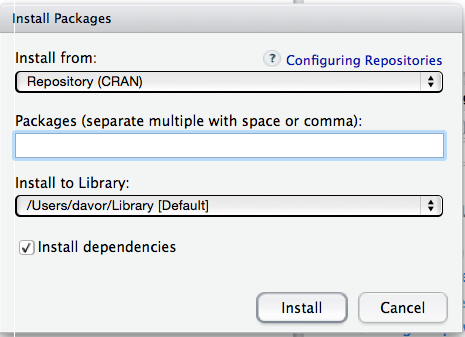

You need to install and test R and RStudio before the workshop. The installation process is simple on all major platforms, and mostly consists of downloading and running the installers appropriate to your platform. Please contact the instructors if you run into difficulties so we can help you show up with a computer properly set up for the workshop.

## R and RStudio

* [Install R](http://www.r-project.org), a free software environment for statistical computing and graphics.
      + It is _highly recommended_ to install a precompiled binary distribution for your operating system -- use the links up at the top of the page linked to above!
    + If you currently have R installed on your laptop, please make sure it is version 3.4.0 or later. *Please update if it is not!*
* [Install RStudio](https://www.rstudio.com/products/rstudio/download/), a powerful user interface for R.

## Testing testing

1. Do whatever is appropriate for your OS to launch RStudio. You should get a window similar to the screenshot below.
    +  If you don't see a window that is divided into distinct areas labelled "Console", "Environment", etc., you are probably running the user interface that comes bundled with R. Check that RStudio {width=0.4in} is present in your applications and start it instead.
  
  {width=70%}
  \ 
  
2. Put your cursor in the left pane labelled "Console", which is where you interact with the live R process. Create a simple object with code like `x <- 2 * 4` (followed by enter or return). In the "Environment" pane, to the right of the Console, you should see an entry for "x" with appropriate value (in this case, 8).
  
3. Then inspect the `x` object by typing `x` in the Console followed by enter or return. You should see the value 8 printed to the screen.

4. Finally, check that plotting works. In the console, type `plot(cars)`. If you see a scatterplot appear in the "Plots" pane to the lower right,  you are good to go.

## Add-on packages
R is an extensible system and many people share useful code they have developed as a _package_ via the Comprehensive R Archive Network [CRAN](https://cran.r-project.org/), [Bioconductor](https://www.bioconductor.org/), or personal GitHub repositories. 

### From CRAN
To install a package from CRAN in RStudio:

1. Go to the "Tools" menu and choose "Install Packages" or click "Install" in the Packages area in the lower right pane of RStudio.
2. The following window appears

  {width=40%}
  \ 
  
3. Enter the name of the desired package
    + The checkmark by "Install dependencies" should be **on**.
4. Click on the "Install" button

Please install the following packages and their dependencies for use in this workshop:

* tidyverse 
    - *Please note that if you have __R v3.3 or older__, you may not be able to install `tidyverse`. In this case, you need to separately install each package within the tidyverse. This includes:* `readr`, `tibble`, `dplyr`, `tidyr`, `stringr`, `ggplot2`, `purr`, `forcats`
* ape
* seqinr
* vegan
* betapart
* abind
* Matrix
* cowplot
* BiocManager
* devtools

### From Bioconductor
To install a package from Bioconductor in RStudio:

1. Make sure you have already installed the `BiocManager` package that contains  the Bioconductor install function.
2. Then run the following in the R console to install

* phyloseq
* ggtree

```{r eval=FALSE}
BiocManager::install("phyloseq")
BiocManager::install("ggtree")
```

### From GitHub
To install a package from GitHub in RStudio:

1. Make sure you have already installed the `devtools` package that contains  the GitHub install function.
2. Then run the following in the R console to install

* phylofactor

```{r eval=FALSE}
devtools::install_github("reptalex/phylofactor")
```

## FastTree
Outside of R/RStudio, we will also be using [FastTree](http://www.microbesonline.org/fasttree) to build phylogenetic trees. This is a command line program.

1. Install FastTree by following the [instructions](http://www.microbesonline.org/fasttree/#Install) for your operating system.
2. Open your terminal program.
    - Mac and Linux users can use the pre-installed terminals available with your operating systems.
    - Windows users need to install a new terminal since the Windows one is not Linux-based. There are many options but we recommend  [GitBash](https://gitforwindows.org/) as it also provides Git, which is used in other related workshops.
3. Test FastTree in your terminal by running the following, replacing the `PathToSoftware` with wherever you've installed the program on your machine.

    ```
    [PathToSoftware]/FastTree -help 

    ```

You should see the help page like so.

```{bash}
/Users/kim/Applications/FastTree/FastTree -help
```


## Further resources

The above is sufficient preparation for this workshop but here are some links if you are interested in reading a bit further.

* How to Use RStudio:
    - <https://support.rstudio.com/hc/en-us/sections/200107586-Using-RStudio>
* RStudio Public Discussion & Troubleshooting Guide:
    - <https://support.rstudio.com/hc/en-us/sections/203994097-RStudio-IDE>
* How to Install R:
    - <http://cran.r-project.org/doc/manuals/R-admin.html>
    - <http://cran.stat.sfu.ca/doc/FAQ/R-FAQ.html#How-can-R-be-installed_003f>
* R FAQ:
    - <http://cran.r-project.org/doc/FAQ/R-FAQ.html>
* More about add-on packages in the R Installation and Administration Manual
     - <http://cran.r-project.org/doc/manuals/R-admin.html#Add_002don-packages>