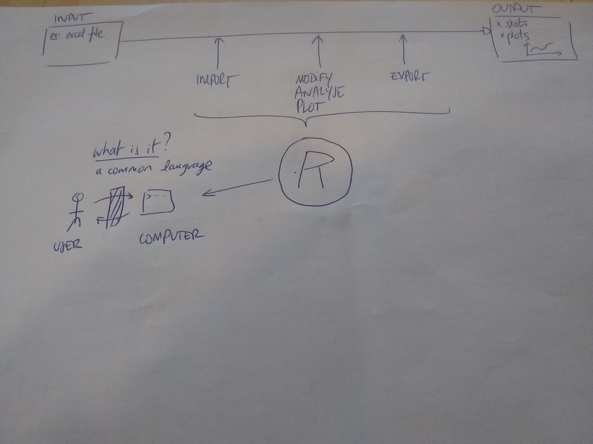
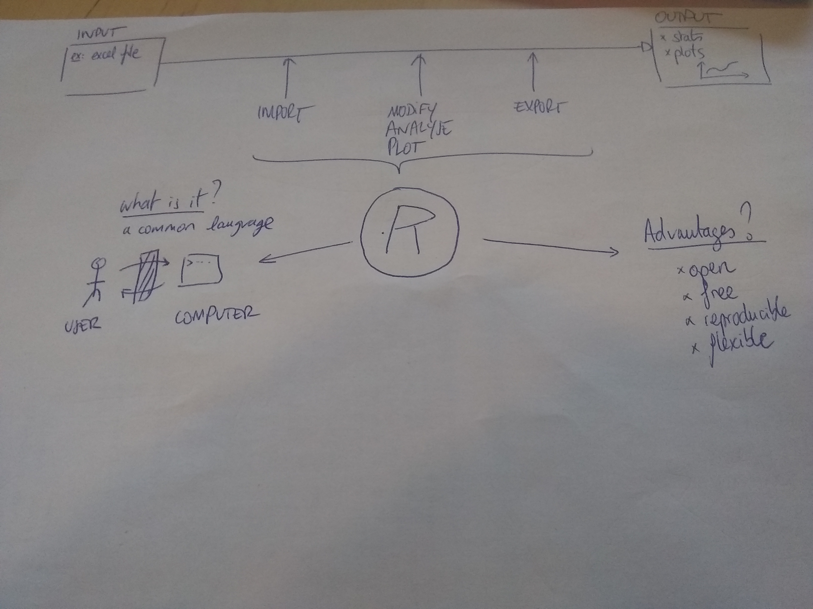
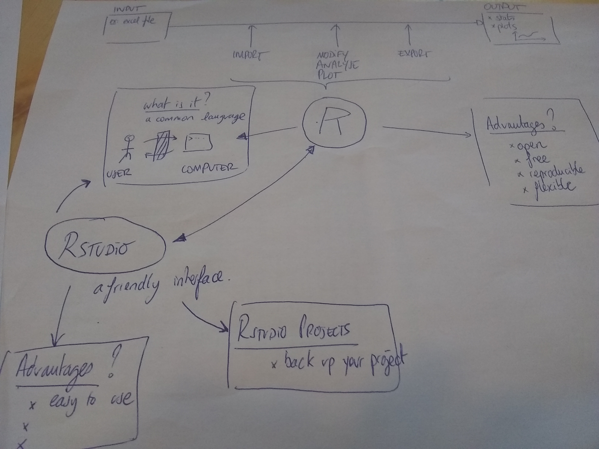
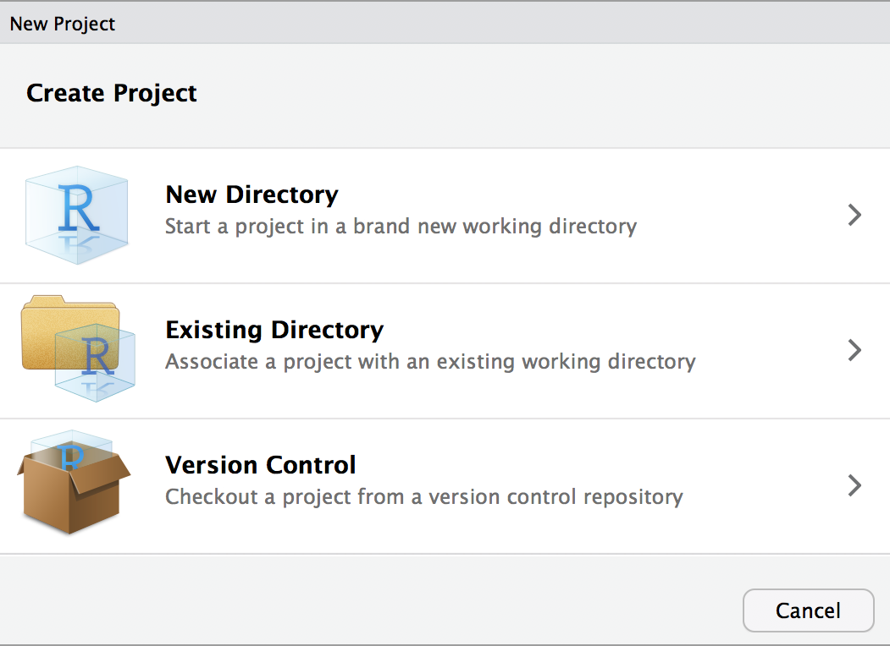
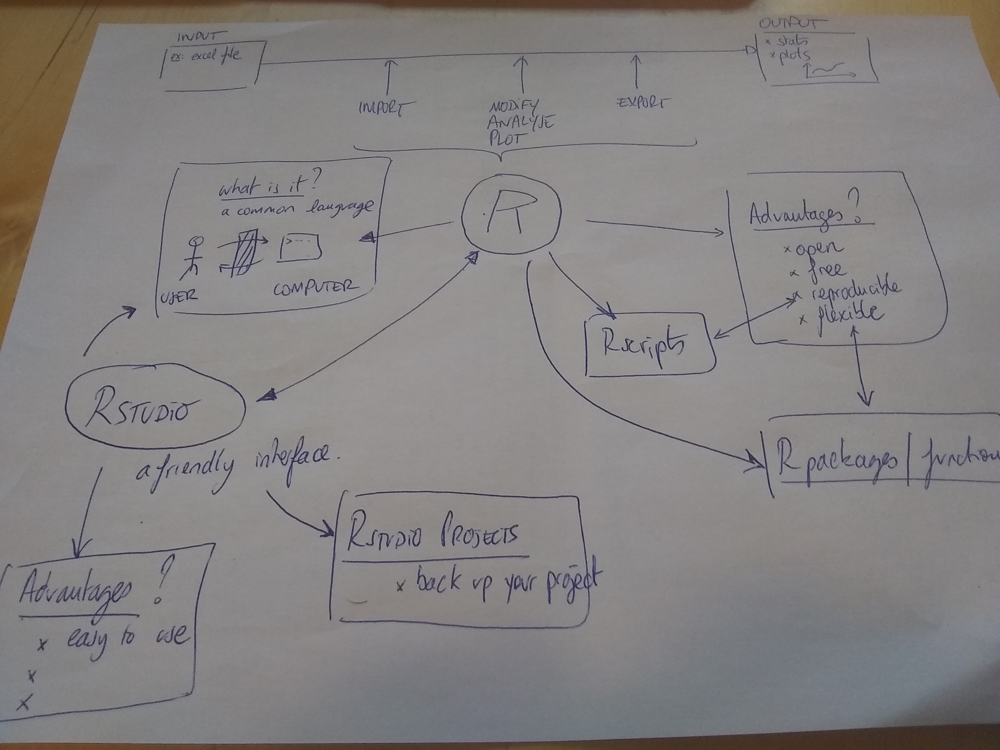
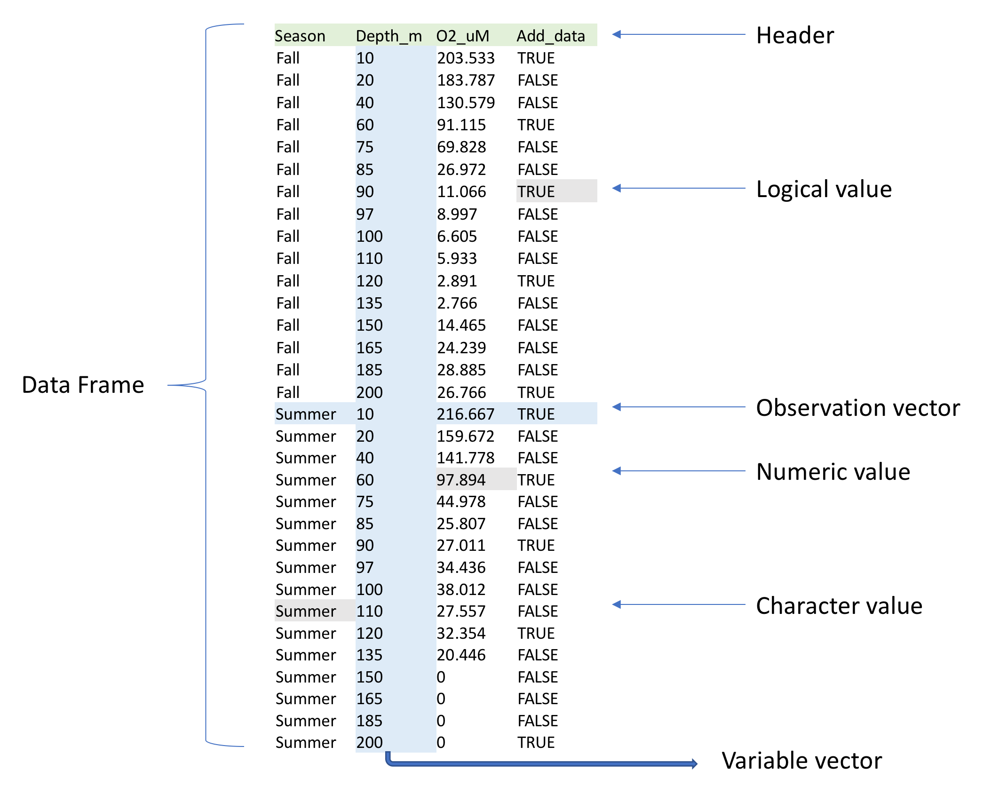

# General introduction of the workshop 

## What are we going to do today? 
In this workshop, we introduce you to R and RStudio at the beginner level. This condensed 2-hour workshop is meant to get you started in R and acts as a pre-requisite for our other workshops.

## How we are going to do it? 

Please use the monitor provided! 

- *Content* : A mix of theory and practice (hopefully more practice)
- *Theory* : please don't hesitate to ask questions!
- *Practice* :use the RED tape to indicate you have troubles coding; use GREEN tape to indicate you are all good 
- *Follow up*: you can ssk more questions at fmazel@zoology.ubc.ca

## Lets start with the basic: what is R? R as a calculator

### Theory : what do we want from R? 

- Input to output 
- Using a common language between user and computer : the concept of language syntax and parsing , delimiter are spaces 




### Theory : Why is this important? Why not using excel instead? 




### Practice: R as a calculator

Question: How do you so some basic calculaitons in R?  

1. Open R
2. Read the information 
3. R as a calulator


```{r}

# Using R to do basic calculations
1+4
2*28 # Multiplication
5^3 # Exponents

# Assigning variables
## Create a new variable called 'x' and assign the number 5 to it
x <- 5
x
# The digit 1 within brackets indicates that the display starts at the first element of x.

## Do calculations with it
x+2

# What happenned if you forget to :, waiting for more inputs, WARNINGs AND ERRORs  

#2+

#my object <- 4
my_object <- 4

```


4. A few tips for the console

- use up and down arrow keys to go back to previously entered commands, which can then be edited and re-run
- TAB for completing the name before the cursor; see more in [online docs](http://www.rstudio.com/ide/docs/using/keyboard_shortcuts).

## What is Rstudio? 

### Theory : definitions 

A friendly interface betwene you and the R console. 



We will do all of our work in [RStudio](https://www.rstudio.com/). RStudio is an integrated development and analysis environment for R that brings a number of conveniences over using R in a terminal or other editing environments.


### Practice

When you start RStudio, you will see something like the following window appear:


Notice that the window is divided into three "panes":

- *Console (the entire left side)*: this is your view into the R engine. You can type in R commands here and see the output printed by R. (To make it easier to tell them apart, your input is printed in blue, while the output is black.) There are several editing conveniences available: use up and down arrow keys to go back to previously entered commands, which can then be edited and re-run; TAB for completing the name before the cursor; see more in [online docs](http://www.rstudio.com/ide/docs/using/keyboard_shortcuts).

- *Environment/History (tabbed in upper right)*: view current user-defined objects and previously-entered commands, respectively.
  - Example: lets define an object as before: 


```{r}

## Create a new variable called 'x' and assign the number 5 to it
x <- 5
```


- *Files/Plots/Packages/Help (tabbed in lower right)*: as their names suggest, these are used to view the contents of the current directory, graphics created by the user, install packages, and view the built-in help pages.

To change the look of RStudio, you can go to Tools -> Global Options -> Appearance and select colors, font size, etc. If you plan to be working for longer periods, we suggest choosing a dark background color scheme to save your computer battery and your eyes.


# The basics of R and Rstudio

## RStudio Projects

### Theory


- When you create a project, RStudio creates an `.Rproj` file that links all of your files and outputs to the project directory. 

- Advantages
  + When you import data, R automatically looks for the file in the project directory instead of you having to specify a full file path on your computer like `/Users/username/Desktop/`. 
  + R also automatically saves any output to the project directory. 
  + Finally, projects allow you to save your R environment in `.RData` so that when you close RStudio and then re-open it, you can start right where you left off without re-importing any data or re-calculating any intermediate steps.

-RStudio has a simple interface to create and switch between projects, accessed from the button in the top-right corner of the RStudio window. (Labelled "Project: (None)", initially.)

### Practice : Create a Project
Let's create a project to work in for this workshop. Start by click the "Project" button in the upper right or going to the "File" menu. Select "New Project" and the following will appear.

{width=50%}
/ 

You can either create a project in an existing directory or make a new directory on your computer - just be sure you know where it is.

After your project is created, navigate to its directory using your Finder/File explorer. You will see the `.RProj` file has been created. 

To access this project in the future, simply double-click the `RProj` and RStudio will open the project or choose File > Open Project from within an already open RStudio window.


During the workshop, we will build an R script together, which will be posted as 'live_notes' after the workshop [here](https://github.com/EDUCE-UBC/workshops_R/tree/master/intro_R_2hr).


## R Scripts

### Theory 




- *Principle*: R script contain the code that loads your raw data, cleans it, performs the analyses, and creates and saves visualizations. You SAVE it

- *Main Advantage*: R scripts maintain a record of everything that is done to the raw data to reach the final result:
  - it is very easy to write up and communicate your methods because you have a document listing the precise steps you used to conduct your analyses. This is one of R's primary advantages compared to traditional tools like Excel, where it may be unclear how to reproduce the results. 
  - You can re-do your analysis if you change the first raw input in a simple click! (not in excel...)

-*Use* - Generally, if you are testing an operation (*e.g.* what would my data look like if I applied a log-transformation to it?), 
you should do it in the console (left pane of RStudio). If you are committing a step to your analysis (*e.g.* I want to apply a log-transformation to my data and then conduct the rest of my analyses on the log-transformed data), you should add it to your R script so that it is saved for future use. 

-*Execute a line - tips * - Put the cursor on the line and click "Run" or press command+return

### Practice

Let's create an R script (File > New File > R Script) and save it as `live_notes.R` in your main project directory. If you again look to the project directory on your computer, you will see `live_notes.R` is now saved there.

We will work together to create and populate the `live_notes.R` script throughout this workshop. 

Lets take an example : assigning values to object and running code from the script into the console

```{r}
x <- 5
x
x+2

```


Script annotation : you should annotate your R scripts with comments. In each line of code, any text preceeded by the `#` symbol will not execute. Comments can be useful to remind yourself and to tell other readers what a specific chunk of code does. 

```{r}

# Assigning variables
## Create a new variable called 'x' and assign the number 5 to it
x <- 5
x
y=x+2
y


```

## R functions

### Theory 

*Definition* ; It is a blackbox with input ('arguments') and output ('value') 

*Syntax* Each R function follows the following basic syntax, where `Function` is the name of the function.

```
Function(argument1=..., argument2=..., ...)
```

### Example 1: the logarithm 

```{r}
# this is a simple funciotn that require only one argument 
log(3)
log(5)

# Some errors
#Log(3)
#log("re")

```

### Example 2: the most helpful of all : 'help' function 
You can read up about the different arguments of a specific function by typing `?Function` or `help(Function)` in your R console.

```{r}
?log
help(log)
help(help)

# What happenned if you forget to : 
#help(plot

```

The `help(Function)` is probably the most usefull fontion in R! When you use a function, you should systematically check its help page first

The help page comes with a title followed by sections which give detailed information.

* Description: brief description.

* Usage: for a function, gives the name with all its arguments and the possible options (with the corresponding default values); for an operator gives the typical use.

* Arguments: for a function, details each of its arguments.

* Details: detailed description.

* Value: if applicable, the type of object returned by the function or the operator.

* See Also: other help pages close or similar to the present one.

* Examples: some examples which can generally be executed without opening
the help with the function example.

For beginners, it is good to look at the section Examples. Generally, it is useful to read carefully the section Arguments.


### Exercice

Using the help function for the logarithm function, compute the log of the number 3 in base 10 

```{r}
?log
log(3,base=10)
```


## R Data types and structures 

### R data types 

Those are the basic types R can handle :numbers, but also characters and logical

```{r}
# Example of number 
x <- 4
?class
class(x)

# Example of character
x <- "Hello"
class(x)
x= "3"
class(x)

# Example of logical

x=FALSE
class(x)

y <- 0==1
class(y)

0>1
0<1

```

### R structures

#### Vectors 

#### Basics

This is a set of elements of the same type. Vectors are constructed with the function 'c' (for combine)

```{r}
# Example of number 
?c
x <- c(4,5,6)
x

# Example of character
x <- c("Hello","Goodbye")

# Example of logical
x <- c(TRUE,FALSE,TRUE)

```

Exercice: Construct a vector containing the number 3,5,7,8 and compute the mean of the set (tip= check how to use the function 'mean')


#### Data frame : 2D table 

One of R's most essential data structures is the data frame, which is simply a table of `m` columns by `n` rows of data. We will read the data shown in Figure 1 into R using the `read.table` function. 


/ 


# Advanced coding: downloading, manipulating, extracting and plotting data


## Downloading data

The following command downloads the data from our [GitHub](https://github.com/EDUCE-UBC/workshop_data) and since you're working in a Project, saves it in the Project directory on your computer.

```{r}
?read.table
```

We are going to use the function read.table. read.table has many arguments; however, we only need to  specify four arguments to correctly read in our data as a data frame. For our data, we will need to specify:

* `file` - gives the path to the file that we want to load from our working directory (current project directory). 
* `sep` - tells R that our data are comma-separated
* `header` - tells R that the first row in our data contains the names of the variables (columns). 
* `stringsAsFactors` - tells R not to read in character columns as a factor variable. You can learn more about factor variables in our [Tidyverse](https://github.com/EDUCE-UBC/workshops/tree/master/intro_tidyverse) workshop. 


```{r}

# Dowloading the data from internet 
?read.table
dat <- read.table("https://raw.githubusercontent.com/EDUCE-UBC/workshop_data/master/data.csv",sep=",", header=TRUE, stringsAsFactors=FALSE)
class(dat)
head(dat)

```


These data contain information on oxygen concentrations sampled at [Saanich Inlet, British Columbia](https://en.wikipedia.org/wiki/Saanich_Inlet) at several depths and during various seasons. It contains:

* Season - season in which measurement was obtained; Fall or Summer
* Depth_m - depth in meters (m) at which measurement as obtained
* O2_uM - oxygen (O~2~) concentration in micromolar ($\mu$M)
* Add_data - whether additional microbiological data was collected; TRUE or FALSE

For a brief introduction to the data used in our workshops, see [Hallam SJ *et al*. 2017. Sci Data 4: 170158](https://www.ncbi.nlm.nih.gov/pmc/articles/PMC5663219/) "Monitoring microbial responses to ocean deoxygenation in a model oxygen minimum zone". More detailed information on the environmental context and time series data can be found in [Torres-Beltrán M *et al*. 2017. Sci Data 4: 170159.](https://www.nature.com/articles/sdata2017159) "A compendium of geochemical information from the Saanich Inlet water column".


## Saving it in your computer 

We are going to write the table on our project folder so we dont have to download it all the time. 

```{r}
?write.table
write.table(dat,"data.csv", sep=",",row.names=FALSE)
```

You can check that a new object appeared in your project folder. 


## R packages: example of data visualization with quickplot

### Theory 


- *Principle*: R packages are units of shareable code, containing functions that facilitate and enhance analyses. 

- *Installation*:  Let's install `ggplot2`, a very popular data visualization package in R that we will use later in the workshop. Packages are typically installed from [CRAN](https://www.r-project.org/) (The Comprehensive R Archive Network), which is a database containing R itself as well as many R packages. Any package can be installed from CRAN using the `install.packages` function. You can input this into your console (as opposed to `live_notes.R`) since once a package is installed on your computer, you won't need to reinstall it again.

### Practice

```{r eval=FALSE}
help(quickplot)
install.packages("ggplot2")
```

After installing a package, and *everytime* you open a new RStudio session, the packages you want to use need to be loaded into the R workspace with the `library` function. This tells R to access the package's functions and prevents RStudio from lags that would occur if it automatically loaded every downloaded package everytime you opened it.

Since this is something you would need to repeat in future, it should go in your `live_notes.R` script.

```{r}
# Data visualization
#help(quickplot)
library(ggplot2)
#help(quickplot)
```


There are many data visualization options in R. The most popular plotting package is `ggplot2`, which is capable of creating publication quality figures.

Let's create a simple depth profile (scatterplot) of the Oxygen concentrations with colors indicating the Season that the sample was collected. We will use the `quickplot` function that we loaded earlier when we installed `ggplot2`.

```{r}
quickplot(data=dat,
     x=O2_uM, 
     y=Depth_m, 
     colour=Season, 
     main="Saanich Inlet: Seasonal oxygen depth profile")
```


## Access some element of vectors and dataframe

#### Accessing vector elements 

Since vectors are 1D arrays of a defined length, their individual values can be retrieved using vector indices. R uses 1-based indexing, meaning the first value in an R vector corresponds to the index 1. Each subsequent element increases the index by 1. For example, we can extract the value of the 5th element of the Oxygen vector using the square bracket operator `[]` like so.

```{r}
# Access some element of the vector
x[2]
x[3]

# Compute the length of the vector 
length(x)
```


### Accessing dataframe elements

Acess a given elemnt of a data_frame

```{r}
dat[5, 3]
dat[5,"O2_uM"]
dat[c(1,2),"O2_uM"] # multiple rows and one column 
```


```{r}
# Acess a entire column
dat$O2_uM
dat[,"O2_uM"]
```

### Exercice

  - determine what depth value occurs in the 20th row
  - what is the class of the variable "Depth", "Season"? 
  

## Subsetting data (rows) from a dataframe: 2 step procedure with a logical vector 


### Examples 

The square bracket operator is most often used with logical vectors (TRUE/FALSE) to subset data. For example, we can subset our data frame to all observations (rows) with an Oxygen concentration of 0. 

```{r}
# Create logical vector for which oxygen values are 0
logical.vector <- dat$O2_uM == 0
#View vector
logical.vector
#Apply vector to data frame to select only observations where the logical vector is TRUE (i.e. the oxygen value is 0)
dat[logical.vector, ]
```

Subsetting is extremely useful when working with large data. You can learn more complex subsets in our [Tidyverse](https://github.com/EDUCE-UBC/workshops/tree/master/intro_tidyverse) workshop using the `tidyverse` packages, which are a popular and widely used suite of R package for working with and visualizing data. 

### Exercice

Subset the data to observations where depth equals 100 m. *Hint*: Use a logical vector. 


# Additional Exercises
To practice skills covered in this workshop and prepare for your future R endeavors, please complete the following exercises. Happy coding!

1. Install the packages used in the next workshop you plan to attend.
    - The R tidyverse: `tidyverse`, `lubridate`, `cowplot`
    - Intermediate R programming: `tidyverse`, `lmerTest`, `devtools`, `roxygen2`
    - Statistical models: `tidyverse`, `broom`, `plyr`, `lme4`, `car`, `lsmeans`, `MASS`, `faraway`, `gapminder`, `HSAUR3`
    - Reproducible Research: `tidyverse`, `packrat`
    - None (but to practice package install anyway): `tidyverse`

*Please note that if you have __R v3.3 or older__, you may not be able to install `tidyverse`. In this case, you need to separately install each package within the tidyverse. This includes:* `readr`, `tibble`, `dplyr`, `tidyr`, `stringr`, `ggplot2`, `purr`, `forcats`

2. Using help to identify the necessary arguments for the log function compute the natural logarithm of 4, base 2 logarithm of 4, and base 4 logarithm of 4.
3. Using an R function, determine what data type the Depth_m variable is.
4. Using indexing and the square bracket operator `[]`:
    - determine what depth value occurs in the 20th row
    - return the cell where oxygen equals 91.115
5. Subset the data to observations where depth is deeper than 100 m. *Hint*: Use a logical vector. 
6. Complete the following code to create a stacked scatterplot of oxygen concentrations within the two different seasons, colored by whether or not microbial data are available (example below).

```{r eval=FALSE}
quickplot(data= ,
     x= , 
     y= , 
     colour= , 
     main="Saanich Inlet: Oxygen in Fall vs. Summer")
```

```{r echo=FALSE}
quickplot(data=dat,
     x=Season, 
     y=O2_uM, 
     colour=Add_data, 
     main="Saanich Inlet: Oxygen in Fall vs. Summer")
```