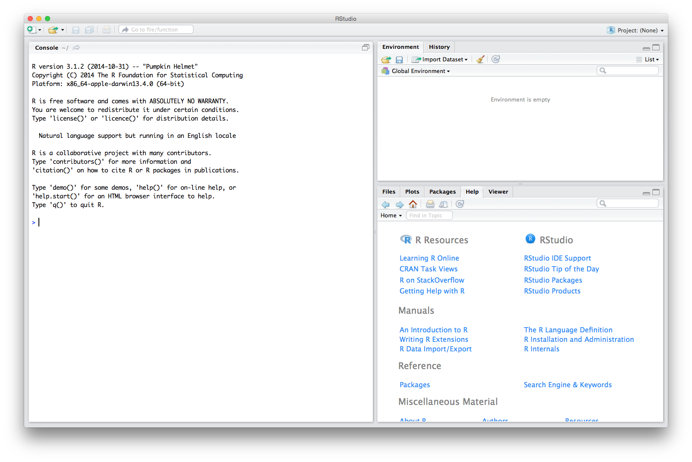
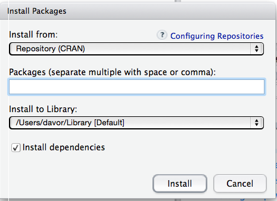

# For all users
You need to install and test R and RStudio before the workshop. The installation process is simple on all major platforms, and mostly consists of downloading and running the installers appropriate to your platform. Please contact the instructors if you run into difficulties so we can help you show up with a computer properly set up for the workshop.

## R and RStudio

* [Install R](http://www.r-project.org), a free software environment for statistical computing and graphics.
      + It is _highly recommended_ to install a precompiled binary distribution for your operating system -- use the links up at the top of the page linked to above!
    + If you currently have R installed on your laptop, please make sure it is version 3.4.0 or later. *Please update if it is not!*
* [Install RStudio](https://www.rstudio.com/products/rstudio/download/), a powerful user interface for R.

## Testing testing

1. Do whatever is appropriate for your OS to launch RStudio. You should get a window similar to the screenshot below.
    +  If you don't see a window that is divided into distinct areas labelled "Console", "Environment", etc., you are probably running the user interface that comes bundled with R. Check that RStudio {width=0.4in} is present in your applications and start it instead.
  
  {width=70%}
  \ 
  
2. Put your cursor in the left pane labelled "Console", which is where you interact with the live R process. Create a simple object with code like `x <- 2 * 4` (followed by enter or return). In the "Environment" pane, to the right of the Console, you should see an entry for "x" with appropriate value (in this case, 8).
  
3. Then inspect the `x` object by typing `x` in the Console followed by enter or return. You should see the value 8 printed to the screen.

4. Finally, check that plotting works. In the console, type `plot(cars)`. If you see a scatterplot appear in the "Plots" pane to the lower right,  you are good to go.

## Add-on packages
R is an extensible system and many people share useful code they have developed as a _package_ via the Comprehensive R Archive Network [CRAN](https://cran.r-project.org/), [Bioconductor](https://www.bioconductor.org/), or personal GitHub repositories. 

To install a package in RStudio:

1. Go to the "Tools" menu and choose "Install Packages" or click "Install" in the Packages area in the lower right pane of RStudio.
2. The following window appears

  {width=40%}
  \ 
  
3. Enter the name of the desired package
    + The checkmark by "Install dependencies" should be **on**.
4. Click on the "Install" button

Please install the following packages and their dependencies for use in this workshop:

* tidyverse
    - *Please note that if you have __R v3.3 or older__, you may not be able to install `tidyverse`. In this case, you need to separately install each package within the tidyverse. This includes:* `readr`, `tibble`, `dplyr`, `tidyr`, `stringr`, `ggplot2`, `purr`, `forcats`
* packrat

# For Windows
### Terminal

1. The native Terminal in Windows is not Linux-based so you need to install [GitBash](https://gitforwindows.org/) for use in this workshop.
    - All command line aspects of the workshop (like Make and git) should be completed in GitBash and not the native "Command Prompt" program.

### Git

1. Basic git was installed automatically with your GitBash Terminal.
    - Test that git is properly installed by opening GitBash and typing `git --version` [Enter]. This should populate the window with information on your version of git such as

```
git version 2.20.1.windows.1
```

2. If you do not already have one, signup for an account on [GitHub](https://github.com/).
3. Download and install the [Git desktop GUI](https://desktop.github.com/).

### Make

1. Download the latest version of [Make](https://www.gnu.org/software/make/) *without guile* from [ezwinports](https://sourceforge.net/projects/ezwinports/files/)
    - The file name is `make-4.1-2-without-guile-w32-bin.zip`, though the most recent version number may be different.
2. Unzip the folder.
3. Copy all of its contents to `c/Program Files/Git/mingw64/`
    - Merge all of the contents of the folders but do NOT overwrite/replace any existing files.
4. Check that Make is installed by typing `make --version` [Enter] in GitBash. This should populate the window with information on your version of Make such as

```
GNU Make 4.2.1
Built for Windows32
Copyright (C) 1988-2016 Free Software Foundation, Inc.
License GPLv3+: GNU GPL verison 3 or later <http://gnu.org/licenses/gpl.html>
This is free software: you are free to change and redistribute it.
There is NO WARRANTY, to the extent permitted by law.
```

# For Mac
### Terminal

The native Terminal in the Mac OS is Linux-based and therefore, can be used in this workshop. You can access it under Applications > Utilities > Terminal.app

### Git

1. Download and [install git](https://git-scm.com/downloads).
Test that git is properly installed by opening your Terminal and typing `git --version` [Enter]. This should populate the window with information on your version of git such as

```
git version 2.18.0
```

2. If you do not already have one, signup for an account on [GitHub](https://github.com/).
3. Download and install the [Git desktop GUI](https://desktop.github.com/). 

### Make

1. Download and install the Mac command line developer tools (including [Make](https://www.gnu.org/software/make/))
by opening your Terminal and typing `xcode-select --install` [Enter]
    - Click 'Install' to allow the installation of the full developer's packet
2. Check that Make is installed by typing `make --version` [Enter] in your Terminal. This should populate the window with information on your version of Make such as

```
GNU Make 3.81
Copyright (C) 2006  Free Software Foundation, Inc.
This is free software; see the source for copying conditions.
There is NO warranty; not even for MERCHANTABILITY or FITNESS FOR A
PARTICULAR PURPOSE.

This program built for i386-apple-darwin11.3.0
```

# Further resources

The above is enough preparation but here are some links if you are interested in reading a bit further.

* How to Use RStudio:
    - <https://support.rstudio.com/hc/en-us/sections/200107586-Using-RStudio>
* RStudio Public Discussion & Troubleshooting Guide:
    - <https://support.rstudio.com/hc/en-us/sections/203994097-RStudio-IDE>
* How to Install R:
    - <http://cran.r-project.org/doc/manuals/R-admin.html>
    - <http://cran.stat.sfu.ca/doc/FAQ/R-FAQ.html#How-can-R-be-installed_003f>
* R FAQ:
    - <http://cran.r-project.org/doc/FAQ/R-FAQ.html>
* How to git
    - <https://githowto.com/>
* GitHub FAQ
    - <https://help.github.com/>